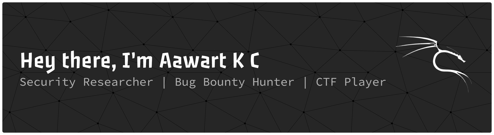

# 

## About Me

  

I'm a Security Researcher who loves <strong>CTF challenges</strong> and <strong>bug bounty hunting</strong>.

<ul>
  <li>Active Security Researcher</li>
  <li>Expert in sleeping more than hacking</li>
  <li>Regular CTF participant, team <strong>Y3ti@Sec</strong></li>
  <li>Always learning, experimenting, and sharing knowledge</li>
</ul>
  

---

## Recognized by

NASA

Got recognized in the NASA Hall of Fame for responsible disclosure.

Cisco

Hall of Fame recognition for 10+ responsible disclosures.

Lenovo

Got recognized in Lenovo Hall of Fame for responsible disclosure.

 

Red Hat

Got recognized in the Red Hat Hall of Fame for responsible disclosure.
  Check Here: https://access.redhat.com/articles/66234

 

New Balance (NB)

Got recognized in the NB Hall of Fame for responsible disclosure.

Zurich Insurance

Got recognized and listed on Zurich Insurance’s HackerOne recognition list for a security report I submitted.

U.S. Department of Veterans Affairs

Hall of Fame recognition for responsible disclosures.

City of Los Angeles

Got recognized and listed on City of Los Angeles HackerOne recognition list for a security report I submitted.

Vertiv

Acknowledged by Vertiv Product Security Team for responsible disclosure, research, and bug hunting.

 

Cochise County IT

Got acknowledged by Cochise County IT, the governing body of Cochise County, Arizona, for a security report I submitted.

---

## Tech & Tools

 
 
 
 
 
 
 
